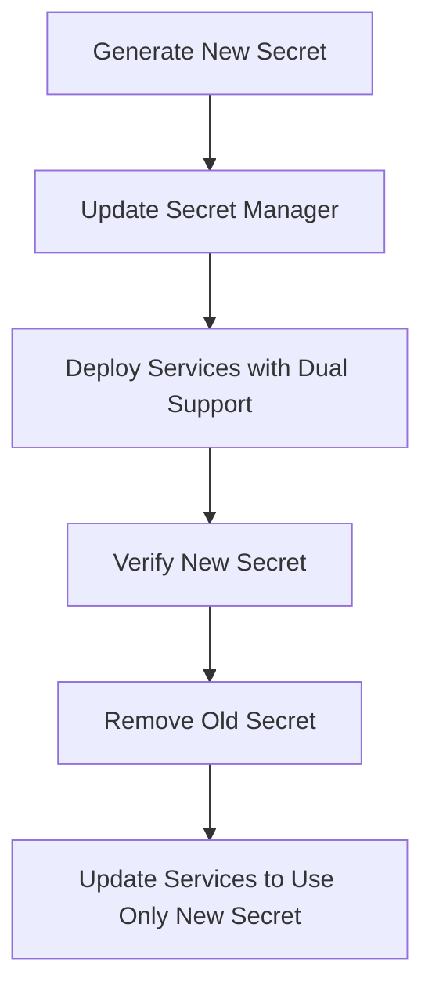

# Secret Management Guide

## Secret Storage Locations
- **Netlify**: Environment variables for frontend and serverless functions
- **AWS Secrets Manager**: For database credentials and API keys
- **HashiCorp Vault**: For high-security environments with strict compliance requirements

## Access Controls
- Follow least-privilege principle
- Use IAM roles for AWS Secrets Manager access
- Implement Vault policies with token-based authentication
- Restrict access to production secrets to authorized personnel only

## Rotation Process
1. **Prepare**:
   - Generate new secret
   - Update services to support both old and new secrets

2. **Deploy**:
   - Update secret in the secret manager
   - Verify services are using the new secret

3. **Cleanup**:
   - Remove old secret after verification period (typically 7 days)
   - Update services to remove support for old secret

## Emergency Rotation
1. Identify compromised secret
2. Immediately generate new secret
3. Update secret in all environments
4. Force rotation of dependent services
5. Audit access logs for suspicious activity

## CI/CD Integration
- Use secret references in CI/CD pipelines
- Never store secrets in code repositories
- Mask secret values in build logs
- Use temporary credentials for deployments

## Best Practices
- Encrypt secrets at rest and in transit
- Audit secret access regularly
- Use short-lived credentials where possible
- Implement automated secret rotation for critical systems
- Store secrets in environment variables, not in code

## Example Rotation Workflow

## Monitoring and Alerting
- Set up alerts for:
  - Secret access failures
  - Near-expiry secrets
  - Unusual access patterns
- Monitor rotation schedules
- Track secret version usage
